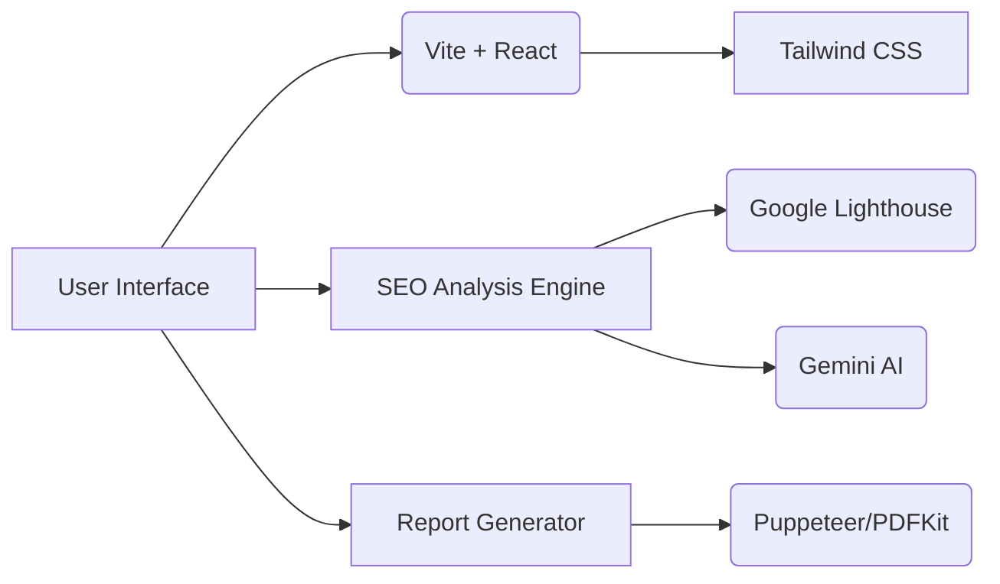

# Together CFO SEO Analyzer 🔍

**AI-powered SEO analysis tool** → [Live Demo](https://tools.togethercfo.com/aiseo)


## 🚀 Key Features

### 🔎 Comprehensive SEO Audit
- **Meta Tag Analysis**: Title, description, OG tags, Twitter cards
- **Content Grading**: Readability scores, keyword density, header structure
- **Technical Check**: Broken links, redirects, canonicals, hreflang

### ⚡ Performance Insights
- Google PageSpeed scores (Mobile/Desktop)
- Render-blocking resources
- Image optimization suggestions
- Core Web Vitals breakdown

### 🤖 AI-Powered Recommendations
- Content improvement suggestions (Powered by Gemini)
- Competitor gap analysis
- Automated fix generation
- Schema markup opportunities

### 📊 Professional Reporting
- One-click PDF generation
- Shareable HTML reports
- Historical comparison
- White-label branding options

## How It Helps Users

```
1. Paste URL → Get instant analysis
2. Review prioritized issues (Critical/High/Medium)
3. Implement AI-suggested fixes
4. Track improvements over time
5. Generate client-ready reports
```

## Tech Stack



## Quick Start

```bash
# Clone and run the analyzer
git clone <Repo>
cd seo-analyzer
npm install
npm run dev

# Access at:
http://localhost:3000/
```